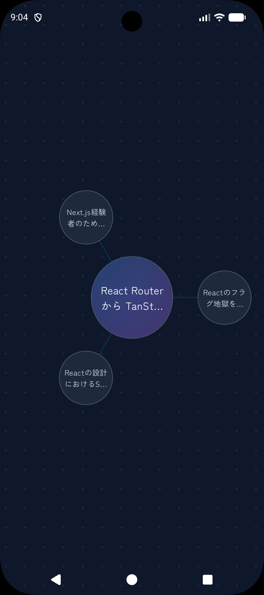
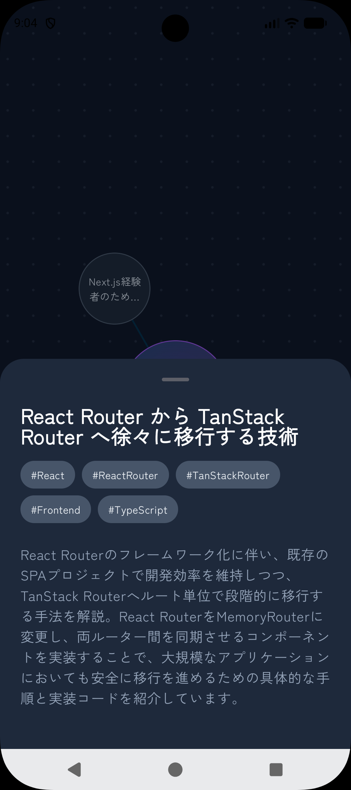
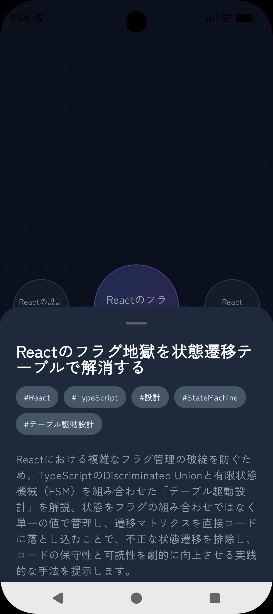
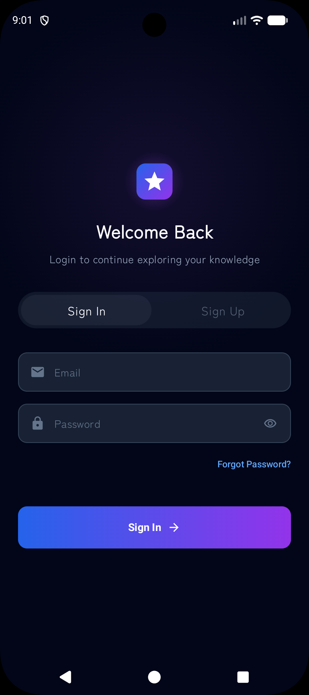

# Constell

AIが知識の「点」を「線」で結び、あなただけの知識の星座を形作るAndroidアプリケーションです。

## 概要

Constellは、散らばった知識（Web記事、メモ、アイデアなど）をAIが分析し、意味的な関連性に基づいて自動的に繋ぎ合わせる「第2の脳」を目指すツールです。単なる情報の蓄積ではなく、知識同士がどのように結びついているかを視覚的に探索することで、新しい発見を促します。

## 主な機能

- **知識の星座（Constellation View）**: 保存した記事やメモが、関連性に基づいたノードとエッジとして星座空間に配置されます。
- **AIによる文脈解析**: 保存された情報の内容をAIが理解し、手動でタグ付けすることなく関連する知識を自動的にリンクします。
- **シームレスな探索**: ある知識から関連する別の知識へと、宇宙を旅するように直感的に遷移できます。
- **ウォークスルー体験**: 初めてのユーザーでも理解しやすいように、機能のコンセプトを伝えるアニメーション付きの導入画面を用意しています。
- **セキュアな認証**: Supabase Authを利用したメール/パスワード認証および各種ソーシャルログインに対応。

## スクリーンショット

|                     |  |
|:------------------------------------------------:|:---------------------------------------------:|
|                      メイン画面                       |                    知識の繋がり                     |
|  |    |
|                       詳細表示                       |                     認証画面                      |

デモに使用させていただいた記事は以下の通りです。
- [Headless UI・shadcn/ui・Material UI の違いを整理する](https://zenn.dev/mukaida/articles/69ec129fa16a6f)
- [Next.js経験者のためのTanStack Router入門 ─ 型安全なルーティングの世界へ](https://zenn.dev/gemcook/articles/about-tanstack-router)
- [Reactのフラグ地獄を状態遷移テーブルで解消する — Discriminated Union×テーブル駆動設計の実践](https://zenn.dev/okamyuji/articles/react-state-pattern-finite-state-machine)
- [React Router から TanStack Router へ徐々に移行する技術](https://zenn.dev/bitkey_dev/articles/react-router-to-tanstack-router)
- [Reactの設計におけるSOLID原則3つの使いどころ](https://zenn.dev/a_sugai/articles/e3f94abe938ab8)

## 技術スタック

モダンなAndroid開発のエコシステムを採用し、スケーラビリティとメンテナンス性を重視した設計を行っています。

### 言語・フレームワーク

- **Kotlin**: 最新の言語機能（Coroutines, Serialization等）を活用。
- **Jetpack Compose**: 完全宣言的なUI構築により、高度なアニメーションとカスタム描画（星座の描画など）を実現。

### アーキテクチャ・デザインパターン

- **MVVM (Model-View-ViewModel)**: UIロジックとビジネスロジックを分離。
- **Dependency Injection (Koin)**: コンポーネント間の疎結合を実現。

### 使用ライブラリ

- **Dependency Injection**: Koin
- **Network**: Ktor Client (CIO)
- **Backend as a Service (BaaS)**: Supabase (Auth, Postgrest, Realtime)
- **Persistence**: DataStore (Preferences)
- **Serialization**: Kotlinx Serialization
- **UI Components**: Material 3, Google Fonts
- **Splash Screen**: Androidx Core SplashScreen

## プロジェクト構造

```text
app/src/main/java/dev/shoheiyamagiwa/constell/
├── composable/        # アプリ全体で共有される共通UIコンポーネント
├── data/              # 共通データリポジトリ（UserPreferences等）
├── di/                # Koinによる依存注入の設定
├── feature/           # フィーチャー（機能）ベースのパッケージ構成
│   ├── auth/          # 認証機能 (Login, Signup, ViewModel, Data)
│   ├── home/          # ホーム画面・星座表示 (ConstellationWorld, ViewModel, Repository)
│   └── walkthrough/   # 導入画面 (WalkthroughSteps, ViewModel)
└── ui/                # テーマ・スタイル定義 (Theme, Color, Type)
```

## セットアップ

Android Studio (最新版を推奨) を開き、プロジェクトをインポートしてビルドしてください。

---
© 2026 Shohei Yamagiwa
